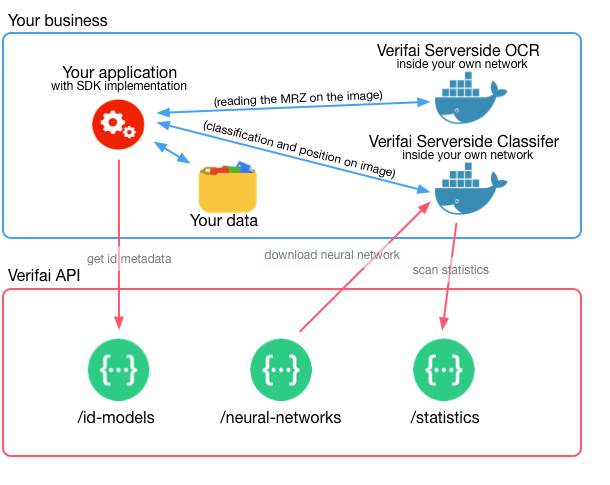

# Verifai SDK for PHP

Great that you choose to use Verifai for your business or project. This software development kit (SDK) takes
care of most of the heavy lifting for you. It is aimed to be used for every level of developer. There are some samples provided so you can see it work.

Companies use Verifai to comply with the GDPR legislation that states
you should not store data about your users and customers that you do not
need for your business. By masking unneeded data you can comply to that.

Features of this SDK are:

 * Detect ID documents in JPEG images (in a privacy guaranteed way)
 * Give you information about the detected document
    * Position in the image
    * Type of document
    * The zones on the document
 * Get a cropped out image from the provided image
 * Get crops of all individual zones
 * Apply masks to the ID document image
 * Read the Machine Readable Zones of documents

## Full documentation

The full documentation can be found at https://docs.verifai.com/

This README only contains the basic setup and a simple classify call.

## Quick introduction

The basic idea is that all of your users or client's private data stays within
your own network. Data we do not have, we can not loose.

Therefore the heavy lifting takes place in the
"Verifai Server-side Classifier" and the SDK. The SDK sends a JPEG image
to it via a HTTP POST request, and it responds with a JSON result. The SDK
processes that response for you. You only have to tell it where the
"Server-side Classifier" is within your network.

When you need more information, like the kind of document you are dealing with, the name, or what
data is where on the document, it fetches that from the Verifai servers.

No personal information is sent to us, never.

## Install

You can use composer to install the package. Easiest is to add it to the
require list.

    {
        "require": {
            "verifai/verifai-sdk-php": "1.*"
        }
    }

Or just install it in your console:

    $ composer require verifai/verifai-sdk-php

You should now have the package installed.

## Initialize SDK

If the setup is tested we can continue with the initialization of the
SDK. From now on we will assume that you initialized the SDK before use.

    require_once 'lib/DocumentFactory.php';
    require_once 'lib/Service.php';

    use Verifai\Service;
    use Verifai\DocumentFactory;
    
    // Provide the default DocumentFactory and setup a Service
    $documentFactory = new DocumentFactory();
    $service = new Service($documentFactory);

    // Setup the service with your API token
    // the token is used for `SDK` <-> `Verifai API` communication.
    $service->apiToken = 'API_TOKEN_IN_HERE';

    // Tell the service where on your network the "Verifai Server-side
    // Classifier" can be found.
    // See the Verifai Server-side Classifier docs for info about how to
    // set it up.
    $service->addClassifierUrl('http://localhost:5000/api/classify/');
    
    // $service is now initialized and ready to use.

## Classify a JPEG image

There are Dutch ID document sample images in the `docs/sample_images/`
directory. We will use `dutch-id-front-sample.jpg` underneath.

    // Assuming you initialized from here on

    // Open a image using the gd lib
    $id = imagecreatefromjpeg('docs/sample_images/dutch-id-front-sample.jpg');

    $document = $service->classifyImage($id);
    echo $document;  // The raw PHP object

    echo $document->getModel();  // "Dutch ID 011"
    echo $document->getCountry(); // "NL"

You now know that there is a "Dutch ID 011" in this image. Lets get it's
position now.

    print_r($document->getPositionInImage())
    // {
    //   'xmax': 0.6118464469909668,
    //   'xmin': 0.21217313408851624,
    //   'ymax': 0.8527788519859314,
    //   'ymin': 0.45336633920669556
    // }

The position is relative, e.g. 0.5 means half way the image. It
the top-left and bottom-right are given. You can use this for further
processing if you like.

Read the full docs at: https://docs.verifai.com/

## Contributions

 * Photo of Groningen (sample\_images/not\_id.jpg) by Sjaak Kempe CC - from [Flickr](https://flic.kr/p/YEXuY1)